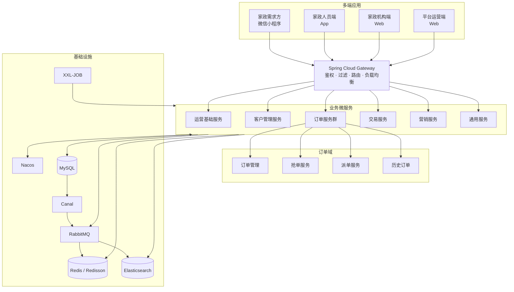
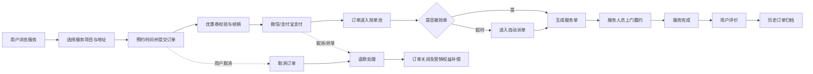
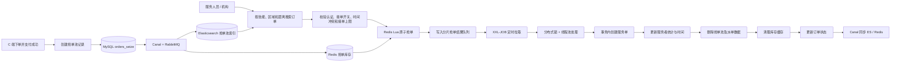

# 拾家家政 · JZO2O

> 一套面向家庭服务场景的多端 O2O 微服务平台，覆盖服务浏览、预约下单、支付退款、抢单派单、上门履约、优惠券、评价与运营管理等完整业务链路。

项目由 **家政需求方、家政服务人员、家政机构、平台运营方** 四类用户端协同组成。后端采用 Spring Cloud 微服务架构，围绕订单、交易、营销、客户与运营基础能力进行领域拆分，并通过 Redis、RabbitMQ、Elasticsearch、Canal 和 XXL-JOB 支撑高并发抢单、异步同步与定时任务。

> 说明：项目源码及部分前端界面中保留了“云岚到家”名称，后端模块统一使用 `jzo2o` 前缀。

## 目录

- [项目亮点](#项目亮点)
- [业务端说明](#业务端说明)
- [系统架构](#系统架构)
- [核心业务流程](#核心业务流程)
- [抢单流程设计](#抢单流程设计)
- [后端模块](#后端模块)
- [前端工程](#前端工程)
- [技术栈](#技术栈)
- [本地运行](#本地运行)
- [项目结构](#项目结构)
- [公开仓库注意事项](#公开仓库注意事项)

## 项目亮点

- **四端业务协同**：微信小程序、家政人员 App、机构管理 Web、平台运营 Web 覆盖完整家政服务场景。
- **订单全生命周期**：支持下单、支付、抢单、派单、服务履约、取消、退款、评价及历史订单归档。
- **高并发抢单**：以 Redis Hash 保存库存和服务者状态，通过 Lua 脚本原子校验及扣减，避免超卖和重复抢单。
- **异步数据同步**：基于 Canal、RabbitMQ 将 MySQL 数据变更同步至 Elasticsearch 与 Redis，兼顾查询效率和最终一致性。
- **分片消费抢单结果**：按城市编码将结果写入多条 Redis 队列，由定时任务并行消费，提高处理吞吐量。
- **任务可靠执行**：XXL-JOB 负责超时取消、退款处理、自动评价、历史订单迁移及抢单结果落库等任务。
- **服务治理能力**：使用 Nacos、Sentinel、Seata、Spring Cloud Gateway 等组件实现注册配置、流量治理、分布式事务与统一网关。
- **搜索与可观测性**：Elasticsearch 支撑按服务、区域、距离等维度检索，Kibana 用于数据检索与运行分析。

## 业务端说明

| 业务端 | 形态 | 核心能力 |
| --- | --- | --- |
| 家政需求方（C 端） | 微信小程序 | 注册登录、浏览与搜索服务、地址管理、预约下单、优惠券使用、支付、取消与退款、订单查询、服务评价 |
| 家政人员端（C 端） | App（uni-app） | 入驻认证、设置服务技能与服务范围、开启/关闭接单、抢单、订单管理、服务记录与评价查看 |
| 家政机构端（B 端） | Web | 机构信息维护、内部人员管理、接单设置、机构抢单、服务单分配与履约管理 |
| 平台运营端（B 端） | Web | 服务与区域管理、机构和人员审核、用户管理、订单管理、优惠券与营销活动、运营统计 |

系统还对接了评价与客服能力，用于形成服务后的反馈与售后闭环。

## 系统架构



## 核心业务流程



## 抢单流程设计

抢单链路将检索、并发竞争和最终落库拆开处理，降低数据库在高并发场景下的直接竞争压力。



关键设计：

1. 已支付订单写入 MySQL 抢单池，并通过 Canal 与 RabbitMQ 同步到 Elasticsearch 和 Redis。
2. Elasticsearch 负责按城市、服务类型、距离等条件检索可抢订单，Redis 保存抢单库存及服务者接单状态。
3. Lua 脚本在 Redis 内原子完成库存校验、服务者状态校验和抢单结果写入，避免并发超卖。
4. 抢单结果按 `cityCode % 10` 分配到 10 条队列，定时任务遍历队列并交由线程池处理。
5. 消费端使用分布式锁防止同一分片被重复执行，并在事务中完成服务单创建、统计更新、缓存清理和订单状态流转。
6. 距离服务开始时间过近且仍未被抢的订单进入派单池，由派单服务按规则自动匹配服务人员或机构。

## 后端模块

| 工程/模块 | 默认端口 | 职责 |
| --- | ---: | --- |
| `jzo2o-gateway` | 11500 | 统一入口，请求过滤、鉴权、负载均衡与路由转发 |
| `jzo2o-framework` | — | 公共基础工程，封装 MVC、MySQL、Redis、RabbitMQ、ES、Canal、XXL-JOB、状态机、Seata、Sentinel 等能力 |
| `jzo2o-api` | — | 基于 OpenFeign 定义服务间远程调用接口及公共 DTO |
| `jzo2o-foundations` | 11509 | 服务类型、服务项目、区域及运营配置等基础能力 |
| `jzo2o-customer` | 11502 | 用户、服务人员、机构、认证、技能、地址与评价管理 |
| `jzo2o-orders-manager` | 11504 | 下单、订单信息及订单状态生命周期管理 |
| `jzo2o-orders-seize` | 11506 | 面向服务人员和机构的抢单、抢单池检索及结果处理 |
| `jzo2o-orders-dispatch` | 11507 | 按派单规则自动匹配服务人员或机构 |
| `jzo2o-orders-history` | 11508 | 冷热数据分离、历史订单查询及订单统计 |
| `jzo2o-orders-base` | — | 订单域公共模型、Mapper、常量及基础能力 |
| `jzo2o-trade` | 11505 | 微信/支付宝支付、支付回调、交易记录与退款 |
| `jzo2o-market` | 11510 | 营销活动与优惠券管理；源码目录名为 `jzo2o-maket` |
| `jzo2o-publics` | 11503 | 文件上传、短信、地图、定位及微信相关通用能力 |

## 前端工程

| 目录 | 对应业务端 | 主要技术 |
| --- | --- | --- |
| `FrontendProject/project-xzb-xcx-uniapp-java` | 家政需求方微信小程序 | uni-app、Vue |
| `FrontendProject/project-xzb-app-uniapp-java` | 家政人员 App | uni-app、Vue |
| `FrontendProject/project-xzb-PC-vue3-java` | 家政机构端 | Vue 3、TypeScript、Vite、Pinia、TDesign |
| `FrontendProject/project-xzb-pc-admin-vue3-java` | 平台运营端 | Vue 3、TypeScript、Vite、Pinia、TDesign、ECharts |

## 技术栈

### 后端

| 分类 | 技术 |
| --- | --- |
| 开发语言 | Java 11 |
| 基础框架 | Spring Boot 2.7.10、Spring Cloud 2021.0.4、Spring Cloud Alibaba |
| 服务治理 | Nacos、Spring Cloud Gateway、OpenFeign、Sentinel |
| 数据访问 | MyBatis-Plus 3.4.3、MySQL、ShardingSphere-JDBC 5.4.0 |
| 缓存与并发 | Redis、Redisson 3.17.7、Lua 脚本、分布式锁 |
| 消息与同步 | RabbitMQ、Canal 1.1.5 |
| 搜索分析 | Elasticsearch 7.17.7、Kibana |
| 分布式事务 | Seata 1.5.2 |
| 任务调度 | XXL-JOB 2.3.0 |
| 状态管理 | Spring StateMachine |
| 接口文档 | Knife4j / Swagger |
| 支付能力 | 微信支付、支付宝 |

### 前端

| 分类 | 技术 |
| --- | --- |
| 小程序 / App | uni-app、Vue |
| Web 管理端 | Vue 3、TypeScript、Vite |
| 状态管理 | Pinia、持久化插件 |
| UI 与可视化 | TDesign Vue Next、ECharts |
| 网络请求 | Axios |

## 本地运行

### 1. 环境准备

建议准备以下开发环境与中间件：

- JDK 11
- Maven 3.8+
- Node.js 16+、npm 或 pnpm
- MySQL、Redis
- Nacos
- RabbitMQ、Canal
- Elasticsearch 7.17.x、Kibana
- XXL-JOB
- 按需启用 Seata、Sentinel

### 2. 配置基础设施

各服务通过 `bootstrap.yml` 加载 `dev`、`test`、`prod` 等环境配置，并从 Nacos 读取共享配置。启动前请完成：

1. 创建业务数据库并初始化所需表与基础数据。
2. 在 Nacos 中准备数据库、Redis、RabbitMQ、Elasticsearch、XXL-JOB、Seata 等共享配置。
3. 配置短信、对象存储、地图、微信支付、支付宝等第三方服务参数。
4. 如使用评价或客服的外部 SDK/服务，请先在本地 Maven 仓库或私服中准备对应依赖。

### 3. 编译后端

后端由多个 Maven 工程组成，建议按公共能力、接口、订单聚合模块、业务服务的顺序安装：

```bash
# 公共父工程及基础组件
mvn -f jzo2o-framework/jzo2o-parent/pom.xml clean install

# 服务间接口定义
mvn -f jzo2o-api/pom.xml clean install

# 订单域聚合工程
mvn -f jzo2o-orders/pom.xml clean install

# 其余服务可按需构建，例如
mvn -f jzo2o-gateway/pom.xml clean package
mvn -f jzo2o-foundations/pom.xml clean package
mvn -f jzo2o-customer/pom.xml clean package
mvn -f jzo2o-trade/pom.xml clean package
mvn -f jzo2o-maket/pom.xml clean package
mvn -f jzo2o-publics/pom.xml clean package
```

### 4. 启动服务

1. 先启动 MySQL、Redis、Nacos、RabbitMQ、Elasticsearch、XXL-JOB 等基础设施。
2. 启动基础业务服务：`jzo2o-foundations`、`jzo2o-customer`、`jzo2o-publics`、`jzo2o-market`、`jzo2o-trade`。
3. 启动订单域服务：`jzo2o-orders-manager`、`jzo2o-orders-seize`、`jzo2o-orders-dispatch`、`jzo2o-orders-history`。
4. 最后启动 `jzo2o-gateway`，通过网关统一访问后端接口。

可在 IDE 中直接运行各模块的 `*Application` 启动类，也可以运行打包后的 Jar。

### 5. 启动前端

Web 工程：

```bash
cd FrontendProject/project-xzb-PC-vue3-java
npm install
npm run dev:pro

# 平台运营端同理
cd ../project-xzb-pc-admin-vue3-java
npm install
npm run dev:pro
```

微信小程序与 App 工程建议使用 HBuilderX 导入对应 uni-app 目录，然后运行到微信开发者工具、Android 模拟器或真机。

## 项目结构

```text
YLDJ/
├─ FrontendProject/                 # 四端前端工程
│  ├─ project-xzb-xcx-uniapp-java  # 家政需求方微信小程序
│  ├─ project-xzb-app-uniapp-java  # 家政人员 App
│  ├─ project-xzb-PC-vue3-java     # 家政机构端
│  └─ project-xzb-pc-admin-vue3-java # 平台运营端
├─ jzo2o-api/                       # 服务间接口定义
├─ jzo2o-customer/                  # 客户管理服务
├─ jzo2o-foundations/               # 运营基础服务
├─ jzo2o-framework/                 # 公共基础组件
├─ jzo2o-gateway/                   # 微服务网关
├─ jzo2o-maket/                     # 营销服务（artifactId: jzo2o-market）
├─ jzo2o-orders/                    # 订单服务群
│  ├─ jzo2o-orders-base
│  ├─ jzo2o-orders-manager
│  ├─ jzo2o-orders-seize
│  ├─ jzo2o-orders-dispatch
│  └─ jzo2o-orders-history
├─ jzo2o-publics/                   # 通用服务
└─ jzo2o-trade/                     # 交易与支付服务
```

## 公开仓库注意事项

将项目上传至 GitHub 前，请重点检查并移除或替换以下敏感信息：

- Nacos、MySQL、Redis、RabbitMQ、Elasticsearch 等服务地址、账号与密码；
- 微信小程序 AppID、支付商户号、证书与密钥；
- 支付宝应用密钥、短信服务密钥、对象存储密钥及地图服务 Key；
- 测试账号、手机号、真实业务数据、日志和本地构建产物；
- `.idea`、`target`、`node_modules`、`unpackage` 等不适合提交的目录。

建议使用环境变量、Nacos 配置中心或密钥管理服务保存敏感配置，并在公开仓库中仅保留脱敏后的配置示例。

---

如果这个项目对你有帮助，欢迎 Star。也欢迎通过 Issue 提交建议与问题。
